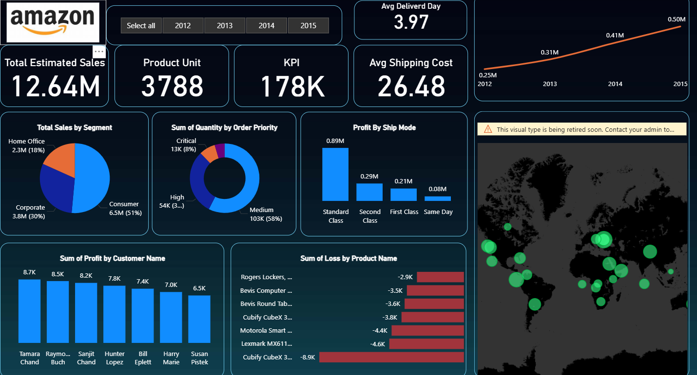

# 📊 Amazon Sales Performance Dashboard

## 🌟 Overview
This **Power BI Dashboard** provides a comprehensive analysis of Amazon's sales performance, offering deep insights into key business metrics, customer behavior, and product trends. It is designed to help stakeholders make data-driven decisions to optimize operations and maximize profitability.

## 🚀 Key Features & KPIs
The dashboard tracks an array of critical KPIs, including:

*   **💰 Total Sales**: Visualized through dynamic bar graphs to track revenue trends over time.
*   **📦 Total Orders**: A snapshot of order volume to ensure efficient inventory and supply chain management.
*   **⏳ Average Delivery Time**: Monitored through line charts to maintain high customer satisfaction levels.
*   **🏷️ Total Products**: Essential metrics for product portfolio management and category analysis.
*   **🔮 Total Estimated Sale**: Predictive insights and forecasting to plan for future demand.
*   **👤 Top 7 Customers**: Identifying and nurturing key client relationships for targeted marketing.
*   **📉 Top 7 Loss-Making Products**: Focused efforts to mitigate losses and improve product margins.
*   **📅 Year-on-Year Sales**: Tracking growth and identifying seasonal trends for strategic planning.

## 🛠️ Tools & Technologies
*   **Power BI Desktop**: For data visualization and dashboard creation.
*   **Excel / CSV**: Primary data source (Global Superstore).
*   **DAX (Data Analysis Expressions)**: For complex calculations and custom measures.

## 📂 Project Structure
*   `Amazone Dashboard.pbix`: The main Power BI project file.
*   `global_superstore.xlsx`: The dataset used for the analysis.
*   `image.png`: High-resolution screenshot of the dashboard.
*   `Amazon_Sales_Performance_Dashboard_...pptx`: Detailed presentation regarding the project findings.

---
*Created with ❤️*
